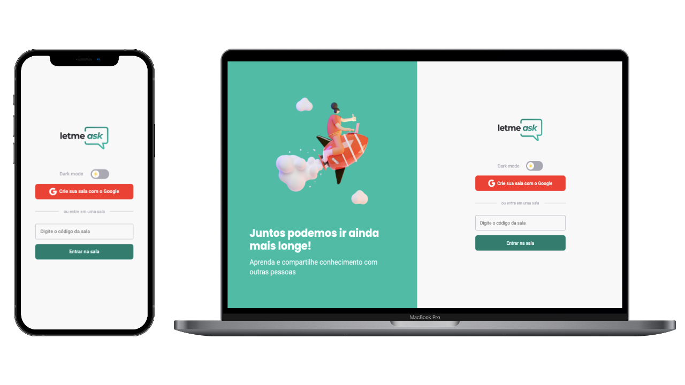

<p align="center">
  
</p>

<br>

## 🧪 Tecnologias

Esse projeto foi desenvolvido com as seguintes tecnologias:

- [React](https://reactjs.org)
- [Firebase](https://firebase.google.com/)
- [TypeScript](https://www.typescriptlang.org/)

## 🖥  Como executar

Clone o projeto e acesse a pasta do mesmo.

```bash
$ git clone https://github.com/ReinaldoCS/Letmeask.git
$ cd letmeask
```

Para iniciá-lo, siga os passos abaixo:
```bash
# Instalar as dependências
$ yarn
# Iniciar o projeto
$ yarn start
```
O app estará disponível no seu browser pelo endereço http://localhost:3000.

Lembrando que será necessário criar uma conta no [Firebase](https://firebase.google.com/) e um projeto para disponibilizar um Realtime Database.

## 💻 Projeto

Letmeask é perfeito para criadores de conteúdos poderem criar salas de Q&A com o seu público, de uma forma muito organizada e democrática.

## 🚀 Milha extra
<br />

Foram adicionadas algumas funcionalidades extras e efeitos visuais para melhorar e tornar o projeto 
ainda mais intuítivo, 
dentre as funcionalidades extras estão:

- Toasts de avisos do sistemas usando o react-hot-toast
- Modal de ações críticas do sistema utilizando o react-modal
- Escolha do tema dark mode ou light mode
- Layout responsivo

## 🔖 Layout

Você pode visualizar o layout do projeto através do link abaixo:

- [Layout Web](https://www.figma.com/file/u0BQK8rCf2KgzcukdRRCWh/Letmeask/duplicate) 
